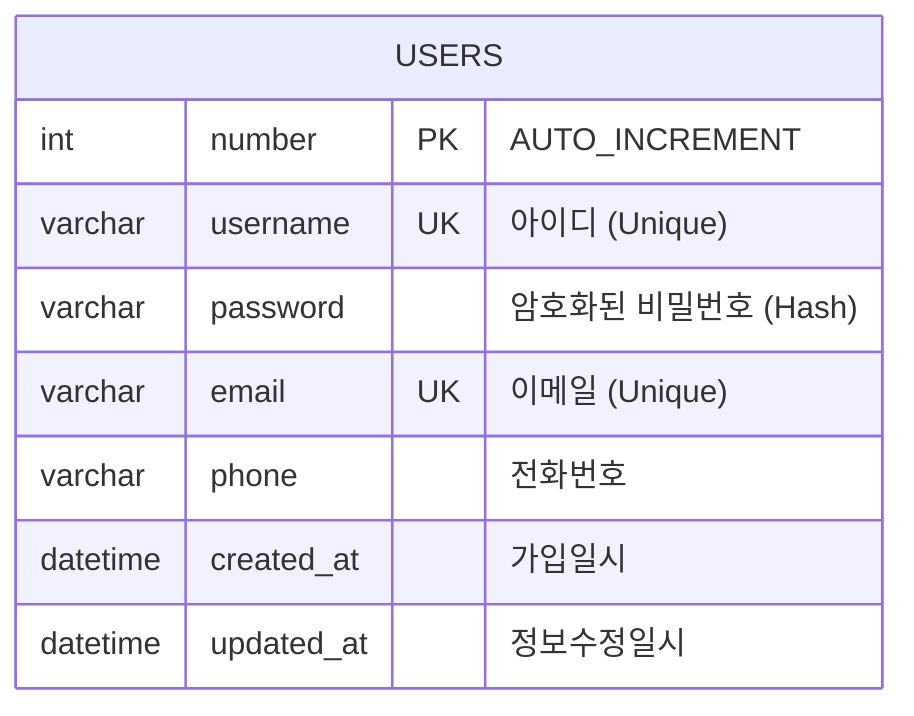

# 영진전문대학교 회원가입 DB 설계서

본 문서는 영진전문대학교 회원가입 페이지에 대응하는 관계형 데이터베이스(RDB) 스키마 설계서입니다. 회원 정보 저장 및 관리를 위한 기본 구조를 다룹니다.

---

## 1. ERD (Entity Relationship Diagram)



---

## 2. 테이블 상세 정의서

### 테이블명: `users` (회원 테이블)

| 번호 | 컬럼명 (Logical) | 컬럼명 (Physical) | 데이터 타입 | Null | Key | 기본값 | 비고 / 제약조건 |
| :--- | :--- | :--- | :--- | :---: | :---: | :--- | :--- |
| 1 | 일련번호 | `number` | `INT` | N | PK | | 자동 증가 (`AUTO_INCREMENT`) |
| 2 | 아이디 | `username` | `VARCHAR(30)` | N | UK | | 영문/숫자 혼합, 중복 불가 |
| 3 | 비밀번호 | `password` | `VARCHAR(255)` | N | | | 단방향 해시 암호화 (BCrypt 권장) |
| 4 | 이메일 | `email` | `VARCHAR(100)` | N | UK | | 표준 이메일 형식, 중복 불가 |
| 5 | 전화번호 | `phone` | `VARCHAR(15)` | N | | | 하이픈 포함 형식 (`010-XXXX-XXXX`) |
| 6 | 가입일시 | `created_at` | `DATETIME` | N | | `CURRENT_TIMESTAMP` | 회원 등록 시점 자동 기록 |
| 7 | 수정일시 | `updated_at` | `DATETIME` | Y | | | 회원 정보 변경 시점 기록 |

---

## 3. 컬럼 설계 가이드라인 및 보안 대책

### 1) 비밀번호 암호화 (`password`)
- **암호 해싱**: 사용자 비밀번호는 평문(Plain Text)으로 DB에 저장해서는 안 되며, 보안을 위해 `BCrypt` 또는 `Argon2`와 같은 강력한 단방향 해시 알고리즘을 사용하여 해시화한 후 저장해야 합니다.
- **최소 길이**: 데이터 타입 크기는 해시 결과물(최대 60~72자 이상)을 충분히 수용할 수 있도록 `VARCHAR(255)` 이상으로 지정합니다.

### 2) 데이터 유효성 검사 및 무결성
- **아이디 (`username`)**: 중복 가입을 방지하기 위해 `UNIQUE` 제약 조건을 추가합니다.
- **이메일 (`email`)**: 사용자 식별 및 비밀번호 찾기 시 고유값으로 활용하기 위해 `UNIQUE` 제약 조건을 설정합니다.
- **전화번호 (`phone`)**: 국가 번호 입력이나 대시(-) 포함 여부를 고려하여 가변 길이 문자열(`VARCHAR`)로 설계합니다.

---

## 4. DDL (Data Definition Language) SQL

다음은 MySQL / MariaDB 기준 테이블 생성 스크립트입니다.

```sql
CREATE TABLE `users` (
  `number` INT NOT NULL AUTO_INCREMENT COMMENT '일련번호',
  `username` VARCHAR(30) NOT NULL COMMENT '아이디',
  `password` VARCHAR(255) NOT NULL COMMENT '비밀번호 (암호화)',
  `email` VARCHAR(100) NOT NULL COMMENT '이메일',
  `phone` VARCHAR(15) NOT NULL COMMENT '전화번호',
  `created_at` DATETIME NOT NULL DEFAULT CURRENT_TIMESTAMP COMMENT '가입일시',
  `updated_at` DATETIME NULL ON UPDATE CURRENT_TIMESTAMP COMMENT '수정일시',
  PRIMARY KEY (`number`),
  UNIQUE KEY `uq_users_username` (`username`),
  UNIQUE KEY `uq_users_email` (`email`)
) ENGINE=InnoDB DEFAULT CHARSET=utf8mb4 COLLATE=utf8mb4_unicode_ci COMMENT='회원 정보 테이블';
```
